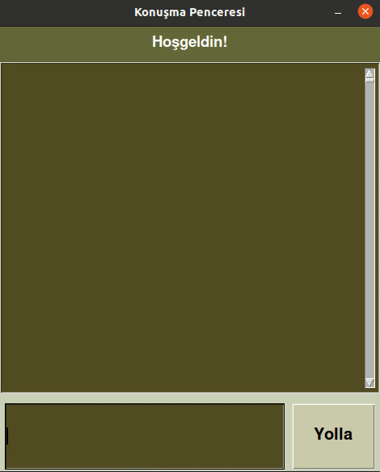

# Introduction

In this repository, I implemented contextual chatbot with Pytorch in based on Turkish intents.

<p align="center"></p>

I stored intents in a JSON file like this:

```
{"intents": [
      {"tag": "selamlama",
      "patterns": ["Selam", "Naber", "Orada biri var mı?", "Slm"],
      "responses": ["Selam!", "Selam, sana nasıl yardımcı olabilirim?", "Selam, hoşgeldin!"]}]
}
```

### Preprocessing consists of:
1. Porter Stemmer
2. Tokenization
3. Bag of words

### Deep Learning Model consists of:
1. Linear Layer
2. Linear Layer
3. Linear Layer
4. RELU

# How to Run?
If you want to train the model yourself you should run:  
`python3 train.py`  
then to open up chatbot interface:  
`python3 app.py`

If you only want to run chatbot interface you can use saved model:  
`python3 app.py`

### References:
* [Contextual Chatbots with Tensorflow](#https://chatbotsmagazine.com/contextual-chat-bots-with-tensorflow-4391749d0077)  
* [Chat Bot With PyTorch - NLP And Deep Learning](#https://www.youtube.com/playlist?list=PLqnslRFeH2UrFW4AUgn-eY37qOAWQpJyg)
